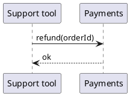

# Payment service

Some prose.

## Refund flow


```plantuml
@startuml
participant "Support tool" as S
participant Payments as P
S -> P : refund(orderId)
P --> S : ok
@enduml
```

```js
// ## not a heading
const x = 1;
```

## Modules

```puml
[Refund handler] --> [Ledger] : book entry
[Refund handler] ..> [Mail sender]
```
